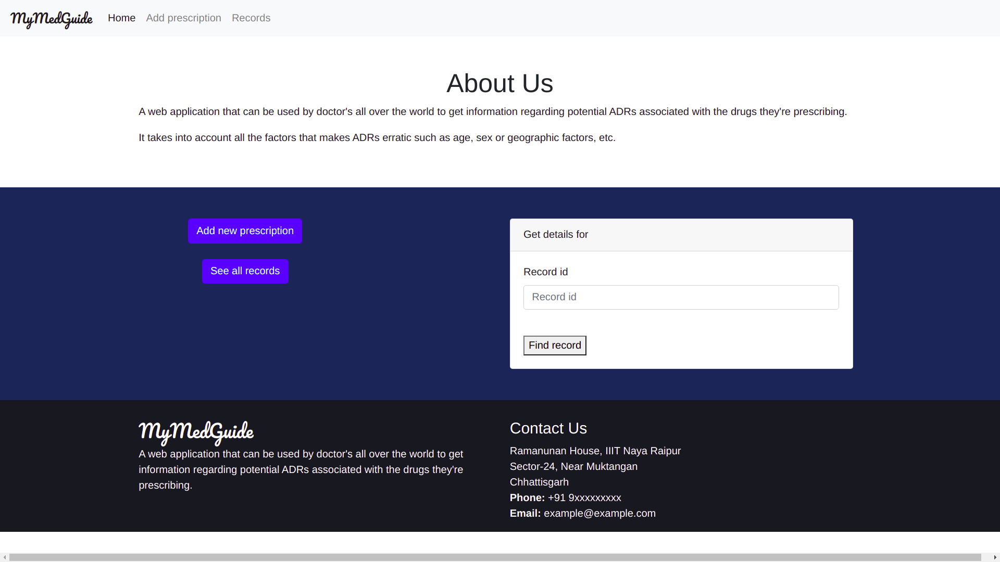
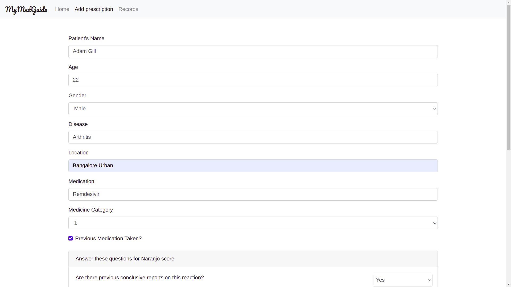
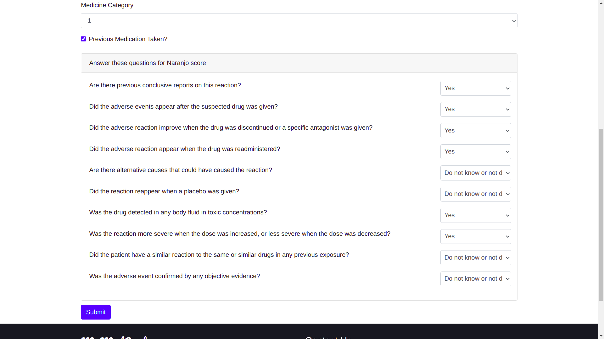
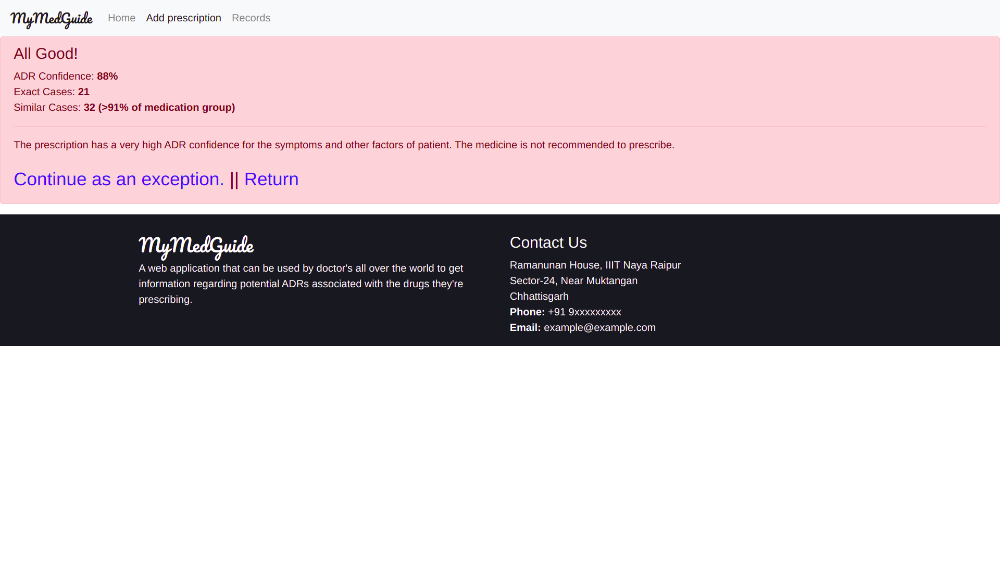
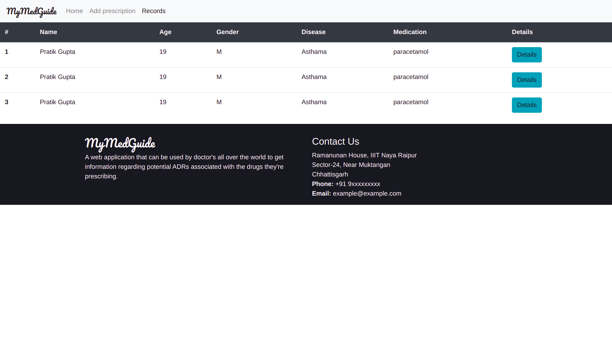
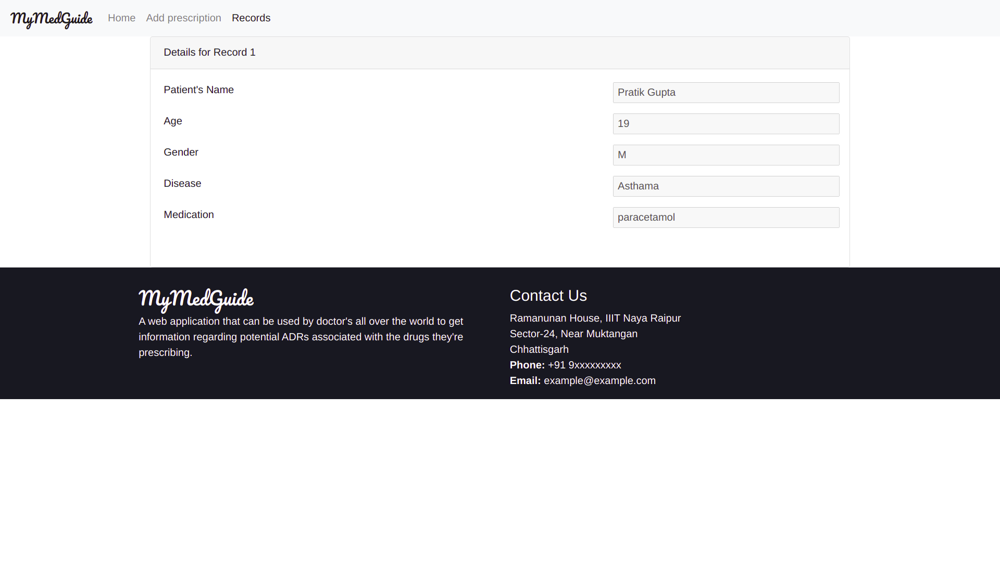

# Early warning system for ADR

## Prerequisites
* Python 3
* Django

## Instructions to get started-
* Clone this repo
* Run `python3 manage.py runserver` to start to server
* Goto `http://127.0.0.1:8000/` on the browser

## Screenshots
**Home screen**

**Add Prescription**

**Naranjo questions in add prescription**

**ADR score screen**

**Prescription Records**

**Record details**

